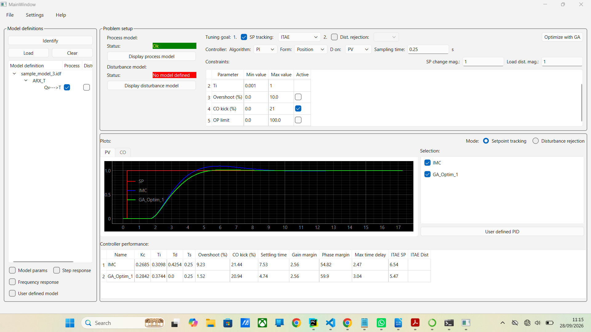
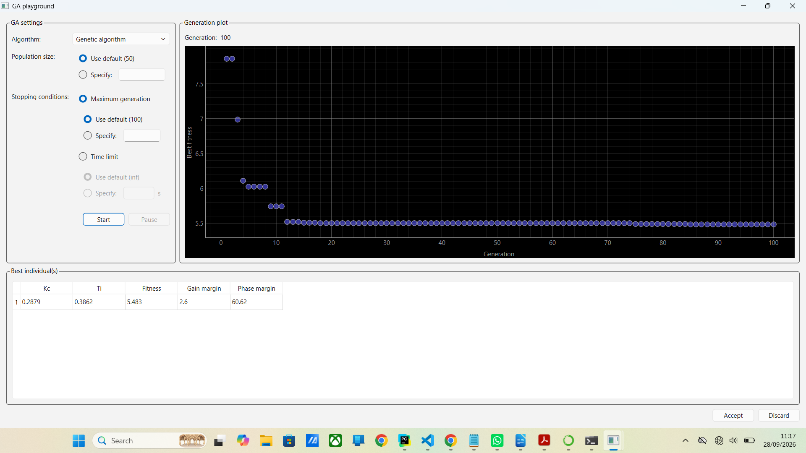
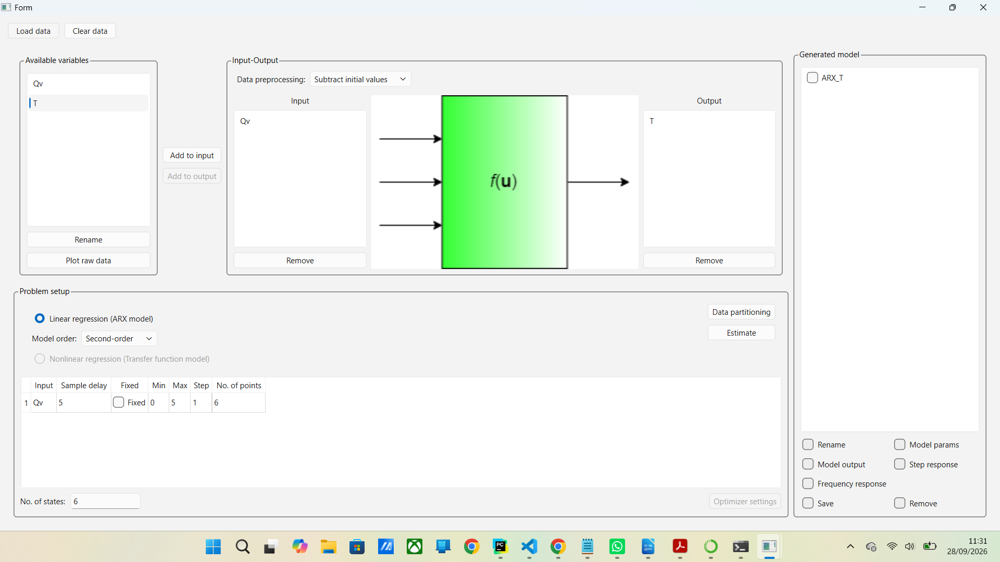

# PID TuneOpt App

A GUI-based application for PID controller tuning and optimization using metaheuristic search optimization based on process CO-PV data

## Installation and Launch

1. **Clone the packages:**
   ```bash
   git clone https://github.com/nazrifuad2020/pid-tuneopt.git
   cd pid-tuneopt
   ```

2. **Install the packages from the root directory:**\
   **using uv:**
   ```bash
   uv sync
   ```
   **or using pip:**
   ```bash
   pip install .
   ```

3. **Launc the app**
   ```bash
   pid-tuneopt-app
   ```

## More instructions to use the app will follow






